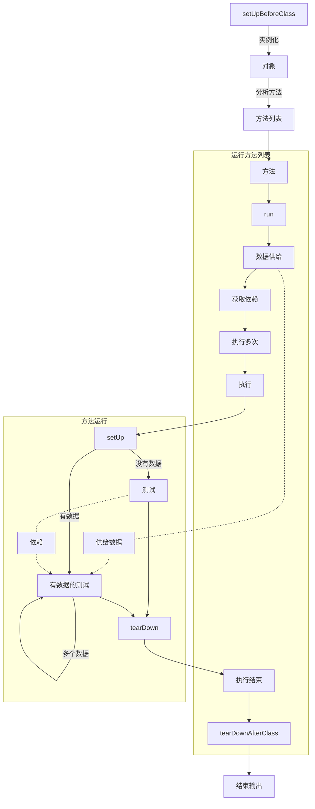

# 框架核心流程

1. 入口
2. 处理参数
3. 扫描文件
4. 确认运行模式
   1. 全部测试
   2. 测试集合
   3. 测试文件
   4. 测试分组
5. 运行测试

```mermaid
graph TD
   setUpBeforeClass -- 实例化 --> 对象
   对象 -- 分析方法 --> 方法列表
   方法列表 --> 方法
   subgraph 运行方法列表
   方法 --> run
   run --> 数据供给
   数据供给 --> 获取依赖
   获取依赖 --> 执行多次
   执行多次 --> 执行
   执行结束 --> tearDownAfterClass
   end
   subgraph 方法运行
   执行 --> setUp
   setUp -- 没有数据--> 测试
   数据供给 -.- 供给数据 -.-> 有数据的测试
   setUp -- 有数据 --> 有数据的测试
   测试  --> tearDown
   测试 -.- 依赖 -.-> 有数据的测试
   有数据的测试 -- 多个数据 --> 有数据的测试
   有数据的测试  --> tearDown
   tearDown --> 执行结束
   end
   tearDownAfterClass --> 结束输出

```